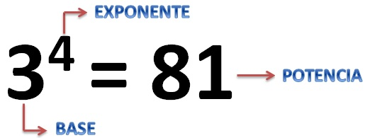
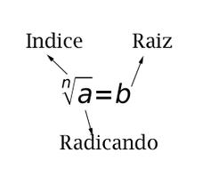
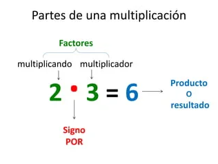
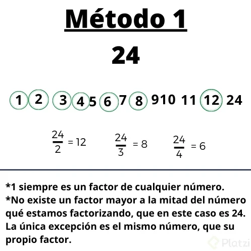
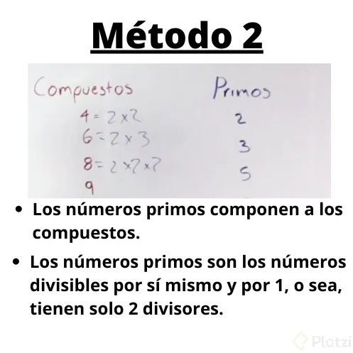
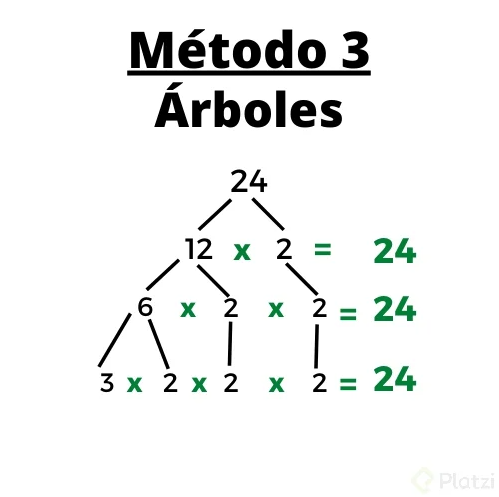
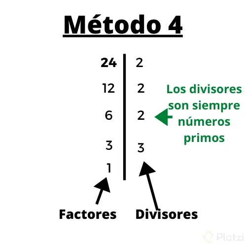

# Ⓜ️ Matemáticas

## La Aritmética

Surgen de la necesidad de contar las cosas y habla de como existen los números. Las operaciones básicas son:

- **Suma:** Consiste en adicionar datos. La suma se representa con el simbolo `+`
- **Resta:** A partir de una cierta cantidad se substrae datos. Símbolo representativo `-`
- **Multiplicación:** Se podría considera como una suma repetida de datos. Símbolos representativos `x`, `*`, `.`
- **División:** Funciona para conformar grupos de datos. Símbolos representativos `/`, `÷`, `—`

### La potenciación y sus propiedades

Es similar a la multiplicación pero en lugar de hacer una suma repetida, se realiza una multiplicación repetida. Ésta se la puede representar con un número de tamaño pequeño encima como por ejemplo: `5²` y también se puede usar un caret: `5^2` sus componentes son:



Cuando se **multiplican** dos potencias con la misma base, únicamente se **suman** los exponentes:

```js
// Las letras pueden representar cualquier número
x^a * x^b = x^(a+b) // Fórmula

2^5 * 2^3 = 2^8 // Usando números

// Note que si juntamos las dos potenciaciones
// se forma una nueva potenciación:
[2 * 2 * 2 * 2 * 2] * [2 * 2 * 2] == 2^8
```

Con la **división** ocurre algo diferente, en lugar de sumar los exponentes, los **restamos**:

```js
x^a / x^b = x^(a-b) // Fórmula

2^5 / 2^3 = 2^2 // Usando números

[2 * 2 * 2 * 2 * 2] / [2 * 2 * 2] == 2^2
```

En caso de que el **exponente** sea `0`, entonces la potencia siempre sería igual a `1`:

```js
2^0 = 1
```

Una potencia cuya base es `0` siempre va a dar `0`, no importa el exponente:

```js
0^3 = 0
```

Un caso excepcional es el de `0^0` donde su resultado podría variar:

```js
0^0 = 1
0^0 = #ERROR
0^0 = undefined
```

### La radicación

Es la que nos permite hallar la base de una potencia. Se compone de los siguientes elementos:



A continuación, algunos ejemplos:

```js
// Fórmulas de raíz al cuadrado
²√16 = 4 
²√5  = 2.236...

// Fórmulas de raíz al cubo
³√8  = 2 
³√16 = 2.519...

// Raíz cuadrada pero a texto plano
16^(1/2) = 4 
 5^(1/2) = 2.236...

// Raíz cúbica pero a texto plano
 8^(1/3) = 4
16^(1/3) = 2.519...
```

### Orden de las operaciones

Si realizamos una operación de izquierda a derecha sin tener en cuenta el orden de los operadores, el resultado será completamente diferente al real. El orden de prioridad a la hora de calcular una operación desde la máxima prioridad a la baja es el siguiente:

1. Parentesis `()` y corchetes `[]`
2. Exponentes `²`
3. Multiplicación `*` y división `/`
4. Adición `+` y sustracción `-`

Ejemplos:

```js
// Operación 1
(3 + 6) * 2 = x
      9 * 2 = 18

// Operación 2
(3 + 2²) * 2 = x
(3 +  4) * 2 = x
       7 * 2 = 14

// Operación 3
20 + 12 / 2 = x
20 +      6 = 26

// Operación 4
4 * 8 / 2 = 16

// Operación 5
2 * 5 + 2 * 4 - 8 + 4 / 2 = x 
   10       8           2
   10 +     8 - 8 +     2 = 12  
```

En la operación 5, siguiendo el orden de los operadores, primero se realizó las operaciones de multiplicación y división, y finalmente se sumó y restó.

### Factorización

Consiste en hallar los factores de X número. Se entiende por factor, los número que se usan para realizar una multiplicación:



Para la suma se les donomina "Sumandos", resta "Diferencia" y división "cociente".

Existen varios métodos para factorizar un producto:

1. **Test de divisivilidad:** Se divide el producto con cada número, sólo aplicaría como factor sí el resultado no contiene decimales:
    

2. **Compuestos / Primos:** Este no es tanto un método sino una comprobación matemática [los números primos](#los-números-primos).
    

3. **Arboles:** Consiste en ir descomponiendo cada factor hasta que finalmente nos encontremos con un nivel en el que no sea posible descomponer un número o mejor dicho que sea un número primo.
    

4. **Columna:** Partiendo desde el primer número primo, se busca descomponer el número de la izquierda hasta que el resultado sea 1.
    

#### Los números primos

El nombre "primos" proviene de la palabra "primeros", lo que significa que los números primos son los primeros números o la base para componer el resto de los números que existen.

Si intentamos descomponer el `7` mediante algún método de factorización, notamos que solo es divisible por `1` y por sí mismo. En cambio, los números compuestos, como el `6`, pueden ser descompuestos en factores primos, por ejemplo, `6 = 2 × 3`. Así, al descomponer números compuestos, veremos que la factorización final siempre consiste en la multiplicación de números primos.

Los números primos menores de `100` son: `2, 3, 5, 7, 11, 13, 17, 19, 23, 29, 31, 37, 41, 43, 47, 53, 59, 61, 67, 71, 73, 79, 83, 89, 97`.
